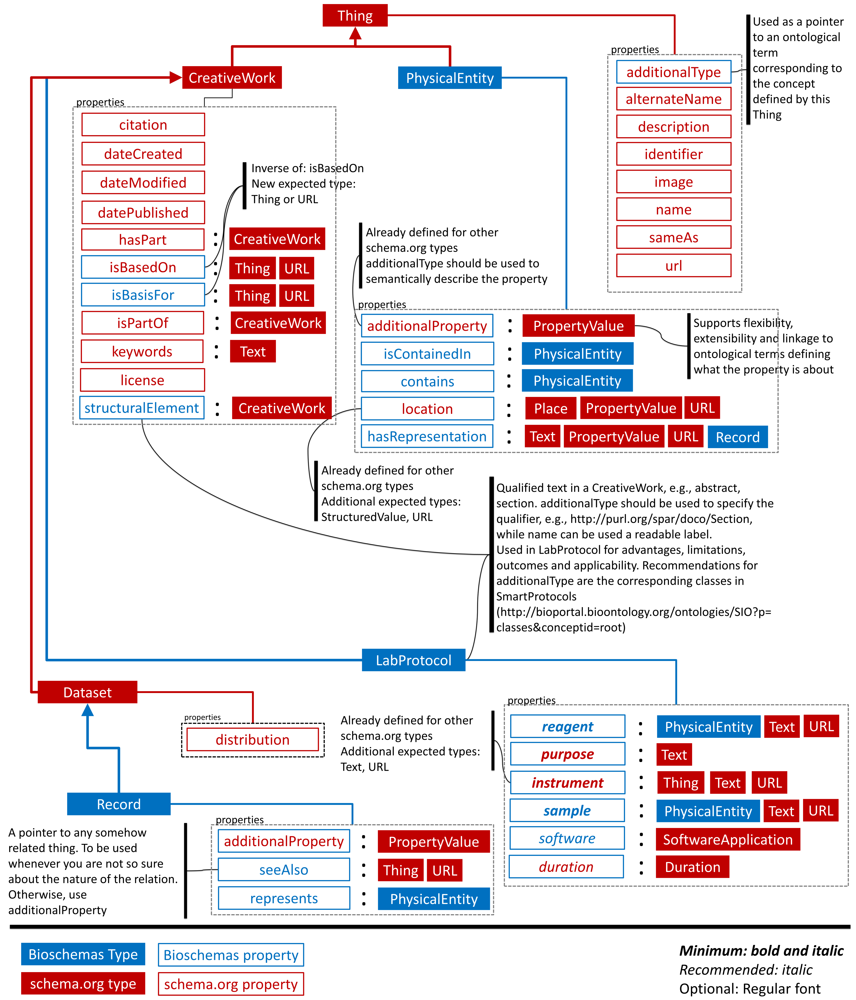

# Bioschemas specifications for Life Sciences

**NOTE**
Please do not edit any specification markdown as they are generated by an application. The specifications at the root are meant to be used in bioschemas.org and are generated with Python, see [map2model repository](https://github.com/BioSchemas/map2model). The specifications inside each specification folder are generated via an add-on [markdonw converter add-on](https://chrome.google.com/webstore/detail/export-as-markdown/hbojhdcnbcondcdfpfocpkjkfkbnbdad). We are working toward simplify and unify these markdown generations.

## LabProtocol
Thing > CreativeWork > LabProtocol

An experimental protocol is a sequence of tasks and operations executed to perform experimental research in biological and biomedical areas.
Experimental protocols are fundamental information structures that support the description of the processes by means of which results are generated in experimental research [1]. Experimental protocols describe how the data were produced, the steps undertaken and conditions under which these steps were carried out.

[1]  Giraldo, O., Garcia, A., Corcho, O.: SMART Protocols: SeMAntic RepresenTation for Experimental Protocols, Riva del Garda, Trentino, Italy (2014). 4th Workshop on Linked Science 2014- Making Sense Out of Data (LISC2014)

### Supporting information
* [Use cases](./LabProtocol/useCases.md)
* [Google docs specification](https://docs.google.com/document/d/1PfykMELldKzw5yj8ymbxdNpHHdDK1UbfokXBhq8QNLY/)
* [Markdown specification](./LabProtocol/specification.md)
* [Full example](./LabProtocol/example.json)

## PhysicalEntity
Thing > PhysicalEntity

A PhysicalEntity is any object that exists in the physical world and cannot be better represented with any other existing type in schema.org. In order to specify the nature of this physical entity, additionalProperty must be used to specify the nature/type of this physical entity. For instance, http://semanticscience.org/resource/SIO_010043 can be used to refer to a protein. 

**Bioschemas usage**

A PhysicalEntity is a flexible and extensible wrapper for Life Sciences entities. Representations of physical entities in Life Sciences are usually recorded in datasets; the link to a dataset should be done via properties. A particular Life Sciences entity, refer to as a profile in Bioschemas, will customize PhysicalEntity by modifying the marginality, cardinality and ontologies used. For instance, a protein profile would recommend pointing to an organism a part of the minimum information, but not necessarily to a sample or disease. 

### Supporting information
* [Use cases](./PhysicalEntity/useCases.md)
* [Google docs specification](https://docs.google.com/document/d/1YUuMkZ-h2WZr0hDtFcozN0ZEqlSXGXyAkUZ56y8-CEo/)
* [Markdown specification](./PhysicalEntity/specification.md)
* [Full example](./PhysicalEntity/example.json)

## Record
Thing > CreativeWork > Dataset > Record

A Record acts itself as a dataset although it refers to what could be seen as the minimum compact, complete and auto-descriptive unit in a dataset, i.e., a record.

**Bioschemas usage**

In Life Sciences, records will represent a PhysicalEntity. A link to the represented physical entity should be done via properties.  

### Supporting information
* [Use cases](./Record/useCases.md)
* [Google docs specification](https://docs.google.com/document/d/1ct7wdN-RHJ4vCXztOOMcPEvZekau-7ybQmHb9of0iTg/)
* [Markdown specification](./Record/specification.md)
* [Full example](./Record/example.json)
 
 
