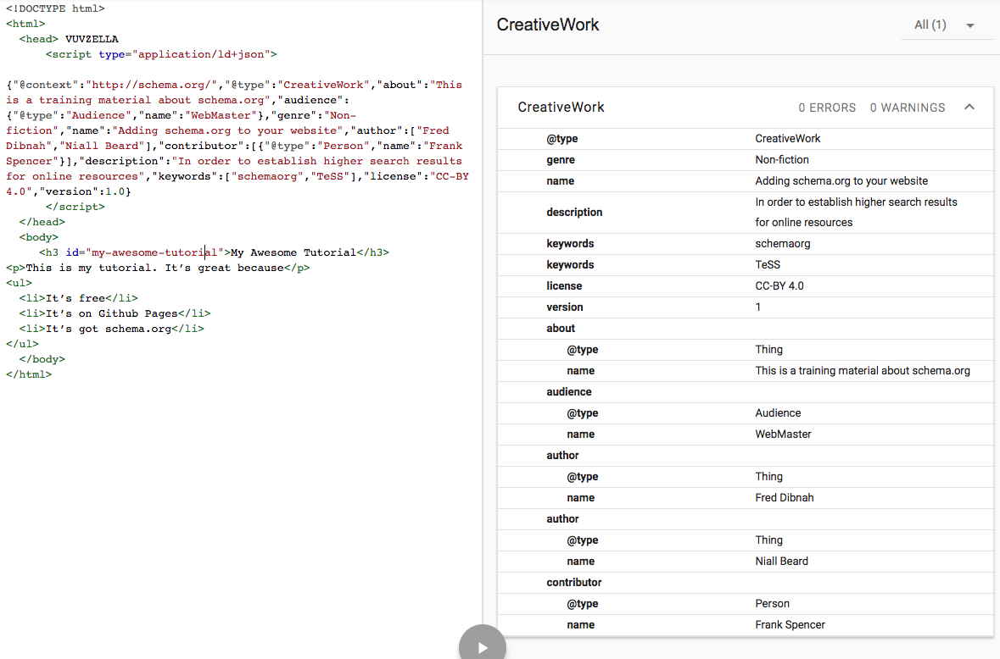
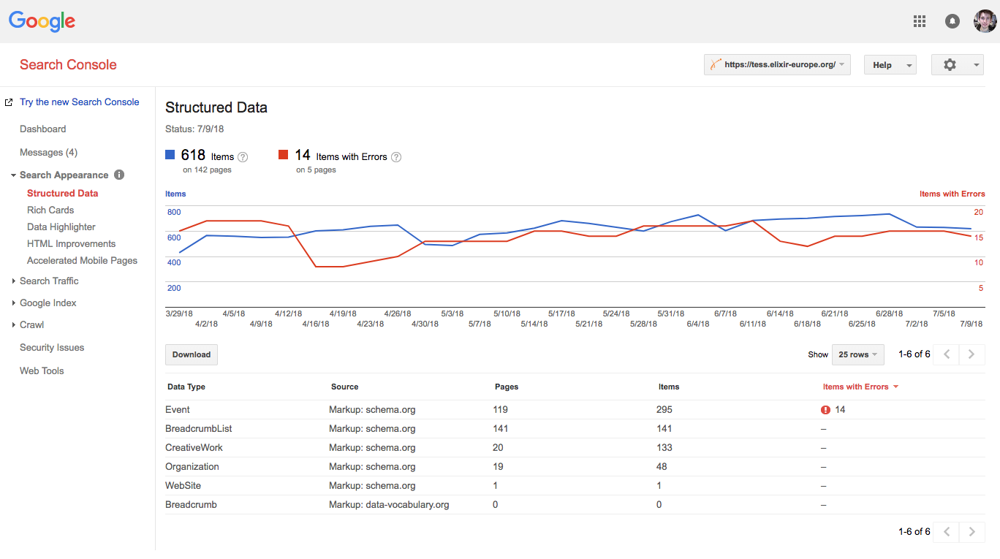

# Adding schema.org to a GitHub Pages site

>This guide will show you how to do add schema.org to GitHub Pages.

## Github Pages

[GitHub Pages](https://pages.github.com/) are an excellent platform for creating informative websites. The hosting is (currently) free which is a huge plus; the collaborative tools allow teams (that may be widely distributed, fluctuating, and/or voluntary) to contribute in a well-structured, verifiable, and open manner; and the version control capabilities are a must in any software project. It’s becoming an increasingly popular choice to make websites with. GitHub Pages makes use of the Jekyll templating engine.

In this tutorial we will set up a new Jekyll site to share our training materials with, and mark-up them using schema.org. 

## Setting up a new Github Page site

First things first, follow [this guide to setting up Jekyll and hosting it on GitHub pages](https://help.github.com/articles/setting-up-your-github-pages-site-locally-with-jekyll/). Once you've got the correct environment setup, you can then create a new app by running `jekyll new my-tutorials`.

In this tutorial we will work with a file structure like below. Something similar to the below should be generated once you generate a new Jekyll site, except for one or two difference. Firstly you can delete/ignore the folder `_posts`, and secondly we will add two folders called `_tutorials`and `_layouts`.

***
```html
├── 404.html
├── Gemfile
├── Gemfile.lock
├── _config.yml
├── _layouts
│   └── tutorial.html
├── _tutorials
│   └── awesome-tutorial.md
├── about.md
└── index.md
```
***

<br/>
Let's create our first tutorial called `awesome-tutorial.md` in the `_tutorials` folder. 

## Adding metadata to your pages

Open `awesome-tutorial.md` and copy the snippet below into it. Jekyll allows you to put what's called [Front Matter](https://jekyllrb.com/docs/front-matter/) at the top of markdown file in [YAML](http://yaml.org/start.html) syntax. Front Matter contains variables, metadata, and layout configuration options. It must be surrounded by 3-hyphens above and below. Beneath that we can add the mark-down content of the webpage.

***
```html
awesome_tutorial.md
---
layout: tutorial
schemadotorg:
  "@context": http://schema.org/
  "@type": CreativeWork
  about: "This is a training material about schema.org"
  audience:
    - "@type": Audience
      name: WebMaster

  name: "Adding schema.org to your website"
  author: ["Fred Dibnah", "Niall Beard"]
  contributor:
    - "@type": Person
      name: "Frank Spencer"
  description: "In order to establish higher search results for online resources"
  keywords: ["schemaorg", "TeSS"]
  license: CC-BY 4.0
  version: 1.0
---

### My Awesome Tutorial

This is my tutorial. It's great because
- It's free
- It's on Github Pages
- It's got schema.org
- I made it
```
***

<br/>

Here we define how to render the page (Line 2), what our metadata is (Line 3-18), and what the page contents will be (Line 21-27).

The first two properties specify which vocabulary we are using - the [CreativeWork](https://schema.org/CreativeWork) vocabulary (`"@type": "CreativeWork"`) from schema.org (`"@context": http://schema.org/`).

You will use a different schema type depending on which schema.org vocabulary you are describing (e.g. `"@type": "Event"` for events, `"@type": "Website"` to describe what your website is, or `"@type": "Recipe"` to describe a potato salad).

Lines 6-18 is a list of key-value pairs. Each key is a property of the CreativeWork vocabulary (e.g. Keywords, Description, Name) along with its value (e.g. ["schemaorg"], "In order to establish...", Adding schema.org..."). The full list of properties, the expected types, and examples on how to use them are all available on vocabulary pages in http://schema.org/CreativeWork. 

We’ve also added `layout: tutorial`to our YAML. This tells Jekyll (the underlying framework) that this page should be rendered as part of a HTML layout template called _tutorial_.

## Rendering your Metadata

Let's create a new folder called `_layouts` and have a new empty file called `tutorial.html` inside. This is where our HTML template used to render our tutorial will be.

Open `tutorial.html` and add the following:

***
```html
tutorial.html

<!DOCTYPE html>
<html>
  <head>
      <script type="application/ld+json">
         {{ page.schemadotorg | jsonify }}
      </script>
  </head>
  <body>
     {{ content }}
  </body>
</html>
```
***

<br/>
This will be the basic layout of on any page that specifies `layout: tutorial` in it's YAML.  

When loading a page that specifies this layout, Jekyll will render tutorial.html and inject the contents (Line 21-27) where the `{{ content }}` tag is. The metadata defined in Lines 2-18 can all be access by their keys.

To render our schema.org we pass the `schemadotorg` metadata to the `jsonify` function. This will convert our schemadotorg keys and values into one of the schema.org supported data-formats; [JSON-LD](https://json-ld.org/). 
Before we can test this, we need to install the jsonify function. Open the file called Gemfile located in the root directory, and add the following lines:

***
```html
source "https://rubygems.org"
gem "jekyll", "~> 3.7.3"

group :jekyll_plugins do
  gem "jekyll-json-ld"
end
```
***

<br/>

Now, in your terminal you can run bundle install to install the `jekyll-json-ldgem` (see [step 2.5](https://help.github.com/articles/setting-up-your-github-pages-site-locally-with-jekyll/) for help). 

Once bundle has install the gem, you can start the jekyll server by running `jekyll serve` and navigate to `127.0.0.1:4000/tutorials/awesome-tutorial.html` in your browser (see [step 4[(https://help.github.com/articles/setting-up-your-github-pages-site-locally-with-jekyll/)] for help) to see your resulting website!

## Testing

On your tutorial page, right click and view the page source.

If all is well, you should see your schema.org JSON-LD data inside the HTML. To test whether this is formatted correctly, you can then go to [Google structured data testing tool](https://search.google.com/structured-data/testing-tool) and copy the HTML in.

|  |
| __Figure 1. Google Structured Data Testing Tool__ |

Once you have created a website that is publicly available online and is correctly formatted with JSON-LD, you can go to the [Google Search Console](https://www.google.com/webmasters/tools/home?hl=en) and see more statistics about what and how Google has indexed the metadata on your site.

|  |
| __Figure 2. Google Search Console displaying indexed Structured Data__ |

In the Search Console you can request re-indexing when your schema.org is setup, view the error rates, and see how people are finding and using your site.

## Making better use of the metadata

If anything about your training material changes (add a new author, rename it etc), you would have to change both the _content_ and the _Front Matter_. But one of the advantages of structuring data into a machine readable format is data becomes very accessible and re-usable.

So instead of duplicating information, we should use the metadata to form the view that website users see. Go back to `_layouts/tutorial.html` and add some more template code to render the metadata variables within the HTML.

***
```html
tutorial.html

<!DOCTYPE html>
<html>
  <head>
      <script type="application/ld+json">
         {{ page.schemaorg | jsonify }}
      </script>
  </head>
  <body>
     <h1>{{ page.schemaorg.name }}</h1>
        by {{ page.schemaorg.author | join: ' and ' }}<br>
        <i>{{ page.schemaorg.about }} </i><br>
        This tutorial is aimed at:
          {{page.schemaorg.audience.first.name}}
       {{ content }} 
  </body>
</html>
```
***