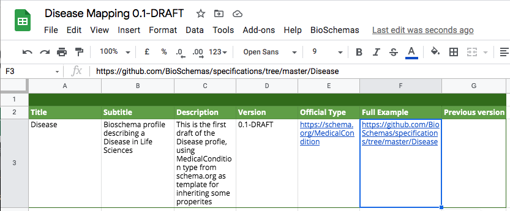
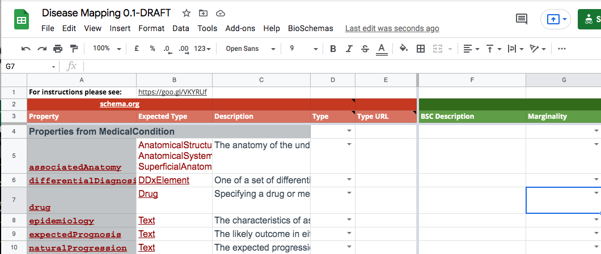
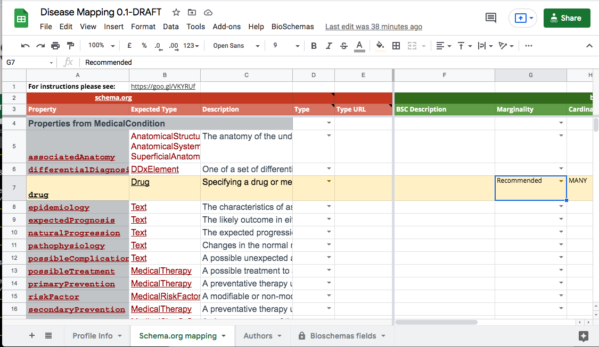
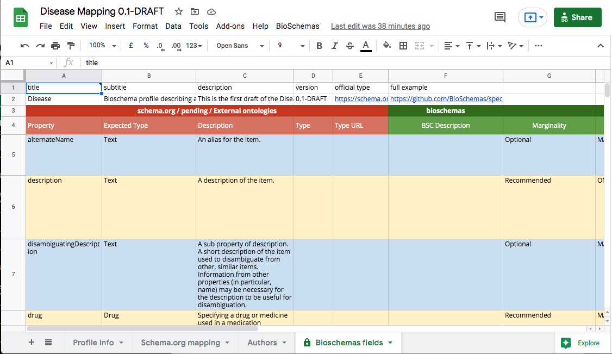

## Before you start

Profiles are developed within working groups. Before starting on a new profile, the Working Group Leads should create a new issue on the [GitHub issue tracker](https://github.com/BioSchemas/specifications/issues) to discuss with the Steering Council the need for the new profile. This will require providing use cases that the profile is aimed to satisfy. For full details, please see the [Bioschemas Governance document](https://github.com/Bioschemas/governance/blob/master/governance.md#proposing-a-new-profile).

## Profile Development Process

The development steps for a profile are:
1. Identify the base Schema.org type for the profile, or develop a new Bioschemas type;  
*__TODO:__ Add link to tutorial for creating a new type*

2. For each property defined for the type

    1. Decide its cardinality recommendation (minimal, recommended, or optional) based on the defined use cases, with a goal of having no more than 6 minimal properties;

    2. Identify, where appropriate, controlled vocabulary terms from existing domain vocabularies to use as values for the property;

    3. Provide an example of the usage of the term;

    4. Map the property to widely used ontology terms in the domain;

    5. Optionally provide a clarification description of how to use the property within the Life Sciences (NOTE: Note that this can only narrow the definition within the life sciences community, not redefine the property.).

3. Ensure that the use case is sufficiently covered, and if required propose new properties for the type;

4. Publish the profile to the draft section of the Bioschemas Profiles page, each published draft should have a unique version number;

5. Validate the profile with sample markup;

6. Deploy markup conforming to the latest draft on at least two resources.

## Starting a New Profile

Bioschemas profiles are developed in GSheets, using a standard template. These are all stored in the [Specification folder](https://drive.google.com/drive/u/0/folders/0Bw_p-HKWUjHoNThZOWNKbGhOODg) in the Bioschemas GDrive.

First you will need to create a new folder in the Specifications folder for your new profile. Use the profile name as the name of the folder. In this tutorial we use the Disease profile as an example. So we would create a folder called `Disease` which is where we store the GSheets for the Disease profile.

You then need to copy the [template GSheet](https://docs.google.com/spreadsheets/d/1kl92O05-_3kjYd37YK8q2eb4A1fpYvn3Mkk6HhtUBEs/edit?usp=sharing) from the [`_templates_`](https://drive.google.com/drive/folders/0Bw_p-HKWUjHoQ2RkUUthWVd3RG8?usp=sharing) folder into your profile folder. Rename the GSheet so that it reflects your profile name and the version, e.g. `Disease 0.1-DRAFT`.

## Populate the Profile content

We will now go through the different tabs in the GSheet and what needs to be done to populate the first version of your Bioschemas profile. Once completed you should have something like the following screenshot.

### Profile Information

The first task is to populate the profile metadata in the `Profile Info` tab. You should populate the table with the values for your profile.

On the "Profile Info" tab you will find:
- __Title:__ The name of your profile, e.g. Disease
- __Subtitle:__ Short description of the specification
- __Description:__ Extended description of the profile. If you want to have links in your text, add them in markdown format.
- __Version:__ Version you want to be display on the website. Format #.#, e.g., 0.1-DRAFT
- __Official Type:__ URL to an existing ontology if applied, e.g https://schema.org/MedicalCondition
- __Full Example:__ URL to the example folder on the [Bioschemas Specification GitHub](https://github.com/BioSchemas/specifications/)



For a new profile, you will need to create a new folder in the specifications repository to store the examples that you develop. Through the GitHub web interface you can create a README file with basic information about the profile using the following template. Remember to put the README file in a folder with a name corresponding to your profile, e.g. `/Disease/README.md`. You will need to change the content of the file to reflect your profile.

```md
# Disease Specification

## Type

Thing > MedicalEntity > [MedicalCondition](https://schema.org/MedicalCondition)

## Profile

The [Disease Profile](https://bioschemas.org/profiles/Disease) presents the Bioschemas markup when describing a disease.

### Example Markup

This repository contains example markup for the Disease profile generated by the [Rare Disease group](https://bioschemas.org/groups/RareDisease/). Examples are purely illustrative and may use fictional data.

Examples should be stored in a subfolder indicating which version of the profile it is valid for. Please check to ensure the example you are reading matches the version of the profile you are interested in.

## Issue Tracker

- [Disease Issues](https://github.com/BioSchemas/bioschemas/labels/type%3A%20Disease)

```

### Profile Properties

The second task is to populate the profile with the properties from your chosen Schema.org or Bioschemas type. These should be included in the `Schema.org mapping` tab. This tab includes the following fields which are split into a `schema.org` section and a `bioschemas` section.

#### schema.org Columns
These columns are copy-pasted from a schema.org type definition page, or filled with types of external ontologies.
- __Property:__ Name of the property from the selected schema.org type or external ontology type, i.e., SIO:is transcribe into. When an external ontology is used the __Type__ you must select "external" from the dropdown on the __Type__ column.
- __Expected Type:__ Expected type for the property. This could be a schema.org property, a bioschemas property or an external ontology one, e.g., URL, BioChemEntity, Thing. These values can be separated by " or " or ",".
- __Description:__ Description of the property. This field accepts __Markdown__ formatting.
- __Type:__ Type for the property, possible types are: _schema.org, pending, external or bioschemas_. Leaving this field blank has the same effect as selecting schema.org. For _external_ and _bioschemas_ type please fill the _Type URL_ column.
- __Type URL:__ URL for the property type; it should be filled when using _bioschemas_ or _external_ as type in order to link the property on the website.

The profile properties can be copied into the GSheet from the Schema.org or Bioschemas type page. Copy the type table from the second row where is should say, "Properties from ...". For the Disease profile, the base Schema.org type is [MedicalCondition](https://schema.org/MedicalCondition). The following screenshot shows the properties after they have been copy and pasted in from table on the MedicalCondition page.

Note that all the expected types need to appear on a separate line within their cell and not in multiple rows. You may need to do some manual editing. Another option is to first paste the content into service that converts the html table code into csv, e.g. [convertcsv](https://www.convertcsv.com/).



#### bioschemas Columns
These columns control which of the properties in the GSheet will appear in the Bioschemas profile.
- __BSC Description:__ Additional text describing the usage of the property within a Bioschemas context. This field accepts __Markdown__ formatting.
- __Marginality:__ Specifies the marginality level for the property with the options of `Minimum`, `Recommended`, or `Optional`. If left blank, then the property will not appear in the profile.
- __Cardinality:__ Specifies how many times the property may occur. The template gives you two possible cardinalities: ONE or Many.
- __Controlled Vocabulary:__
  This field contains a list of terms or ontologies that provide values for this property. This field accepts __Markdown__ formatting.
- __Example:__ A small JSON-LD markup example for the property. Indentation will be kept when it is embedded on the website.

You should now go through the properties for you profile and state their marginality level, their cardinality, when expected values are to be drawn from a domain ontology, and an example. When you change the marginality you will notice that the row gets highlighted: green for Minimal, yellow for Recommended, and blue for Optional. In the following screenshot you will see that the `drug` row is highlighted yellow because its marginality level has been set to Recommended.



## Authors

While there is an `Authors` tab in the GSheet, this is not copied across to the website. You are free to declare authorship here, but the website version of the profile will be populated by the members of the working group.

## Reviewing the Profile

The `Bioschemas fields` tab provides a view over the properties that matches the profile; it only includes the properties from the `Schema.org mapping` tab that have a marginality level declared. This is useful for checking your progress and for reviewing your work.



## Next Steps

Once you have completed a first draft of the profile, you are ready to get it published onto the Bioschemas website in the draft profiles page. The steps for this process are given in the [how to publish a profile to the web tutorial].  
*__TODO:__ add link to tutorial*
