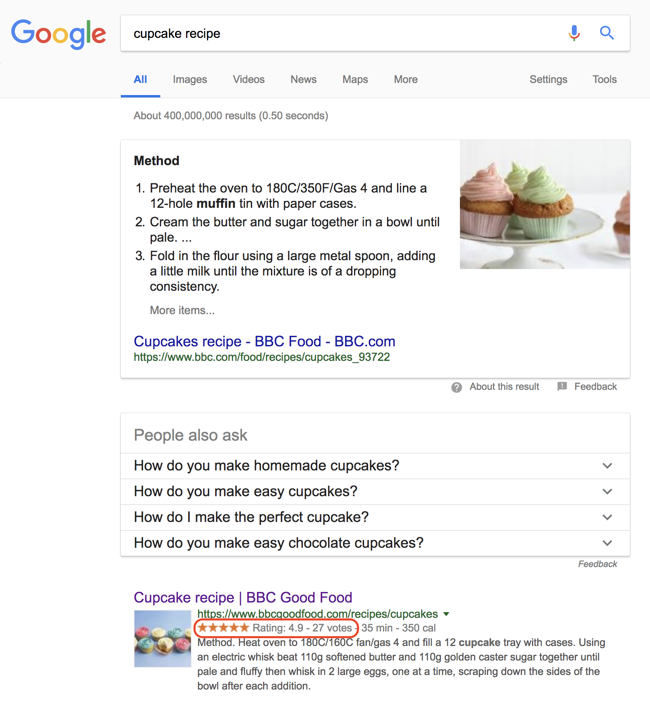
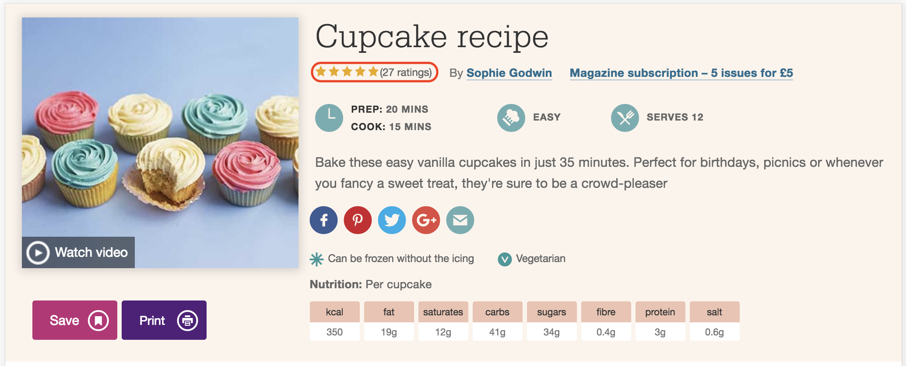
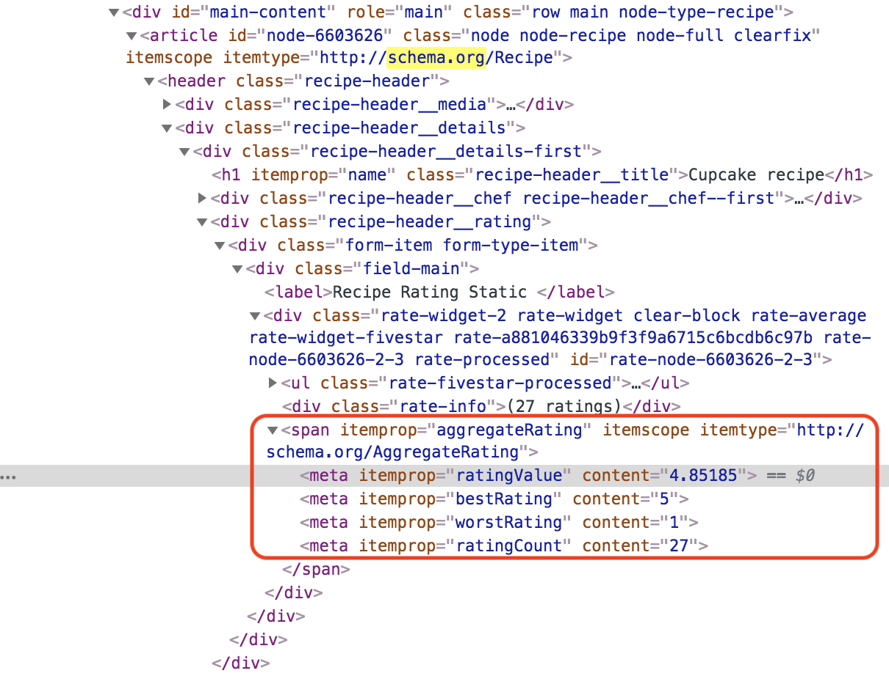
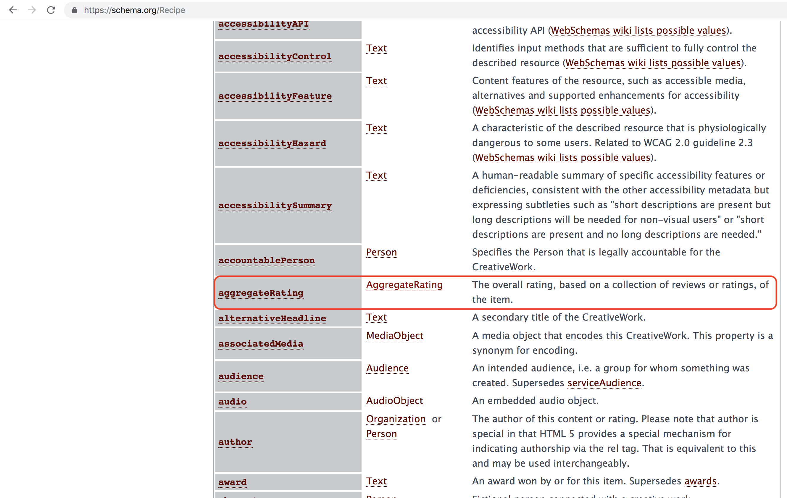
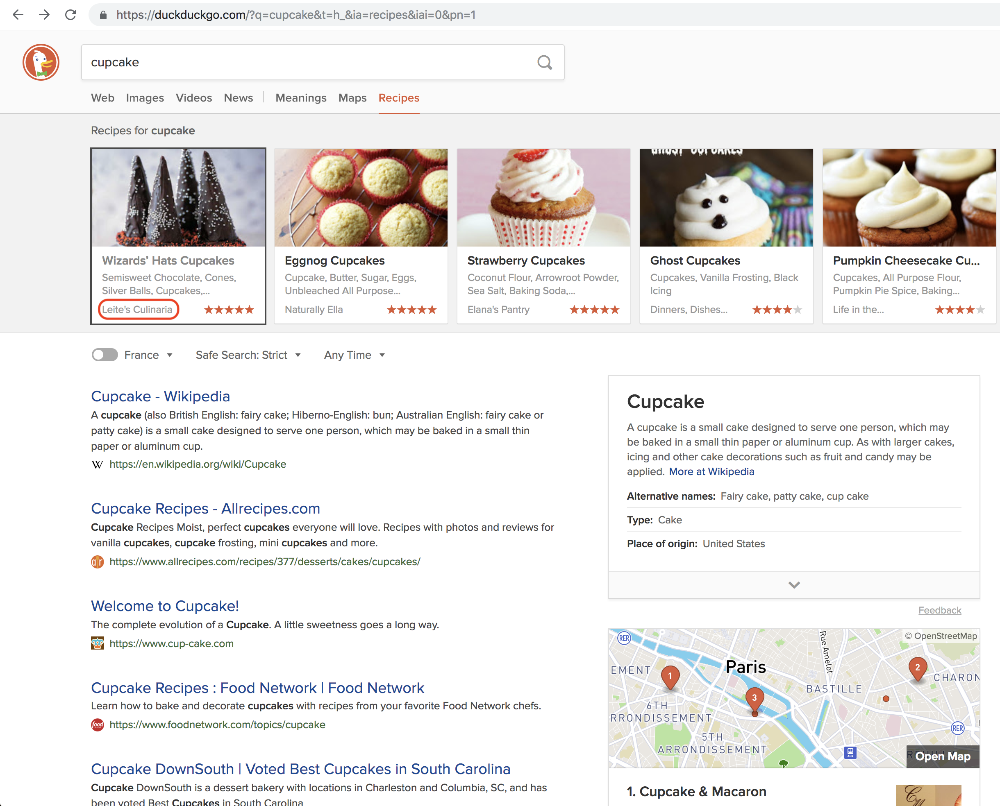
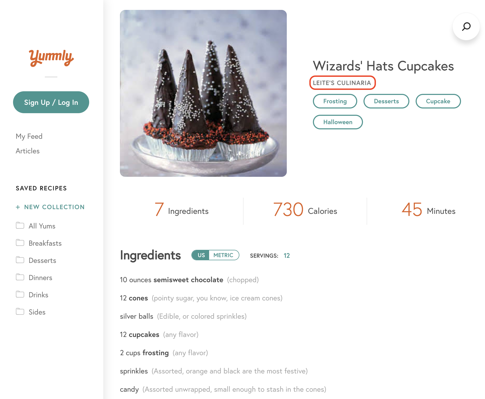
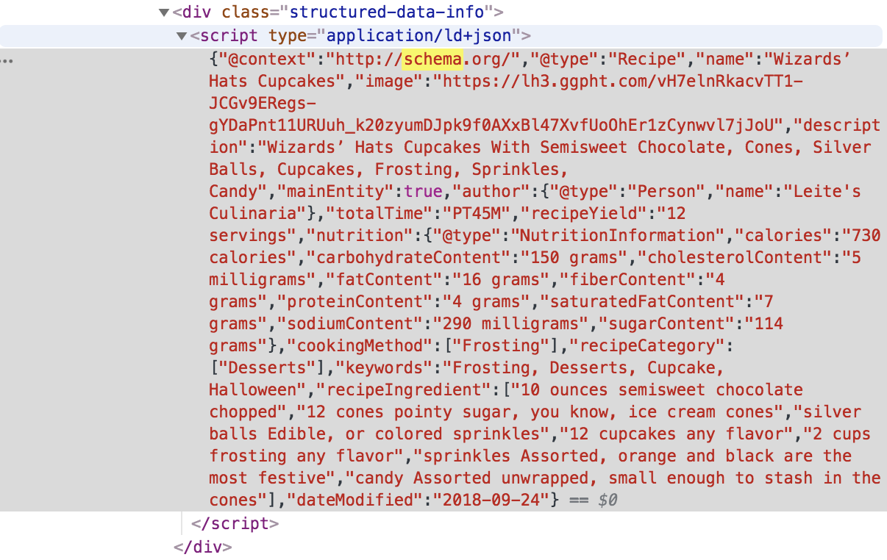
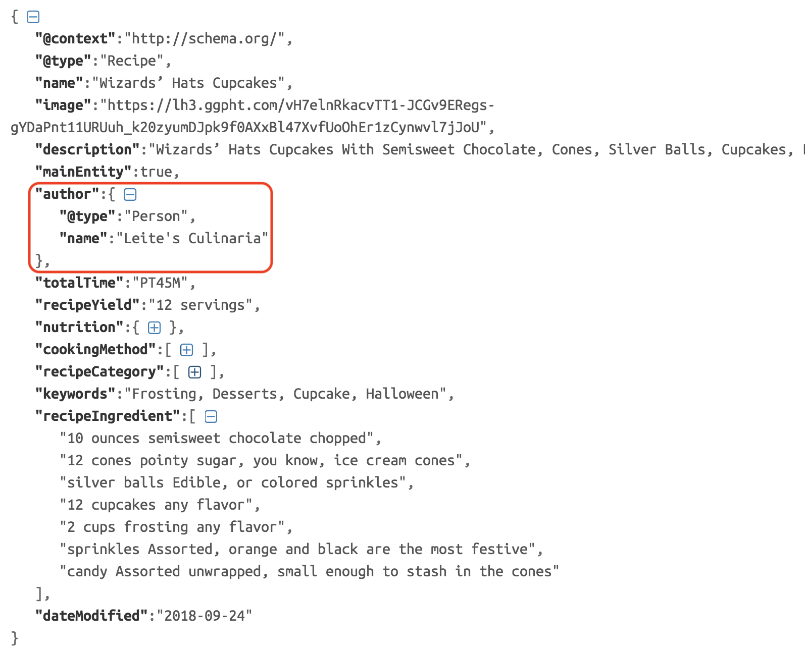
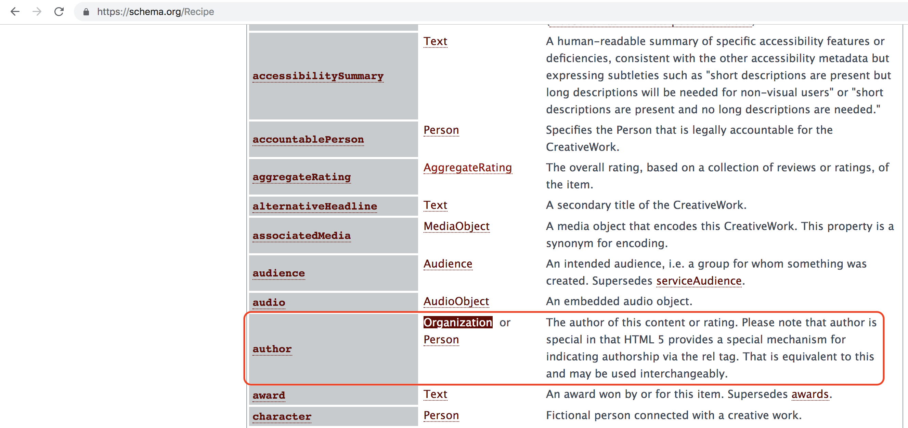

# Schema.org markup examples

>With these examples you will get a better understanding of benefits brought by structure data, i.e., schema.org markup

***
&#9664; Previous tutorial: [What and why schema.org](./what_why_schema) | Next tutorial: [What and why Bioschemas](what_why_bioschemas) &#9654; 

***

## Google cupcake microdata

By performing a simple search of cupcake recipes on Google, see Figure 1, we will have as a result a preview of the information shown on the website even before going to the actual website; information such as the recipe name, rating, cooking time, calories and a description.

|  |
| __Figure 1: Cupcake recipe search in Google__ |

Displayed on the website you can find the same rating details shown on the Google card, see Figure 2.

|  |
| __Figure 2: Cupcake recipe card__ |

And behind the scenes this metadata, used by Google on its search result cards, its marked schema.org, see Figure 3.

|  |
| __Figure 3: Cupcake recipe HTML__ |

The type used on the markup `itemprop="aggregateRating"` is referencing the property on https://schema.org/Recipe website, see Figure 4.

|  |
| __Figure 4: Cupcake recipe HTML__ |

## DuckDuckGo cupcake jsonld

DuckDuckGo take advantage of schema.org in a similar way Google does, see a search on Figure 5.

|  |
| __Figure 5: Cupcake recipe search in DuckDuckGo__ |

The author of the recipe could be found on the search result card and the actual website as seen below, Figure 6.

|  |
| __Figure 6: Cupcake recipe card in DuckDuckGo__ |

and behind the scenes, Figure 7, we will find the `json-ld` tag with the Recipe information

|  |
| __Figure 7: Cupcake recipe JSON-LD in DuckDuckGo__ |

The author property, for instance, holds the name we are seeing displayed on DuckDuckGo result search cards, Figure 8.

|  |
| __Figure 8: Author information__ |

As expected from the documentation on schema.org, see Figure 9.

|  |
| __Figure 9: Author property in schema.org__ |

***
&#9664; Previous tutorial: [What and why schema.org](./what_why_schema) | Next tutorial: [What and why Bioschemas](what_why_bioschemas) &#9654; 

***