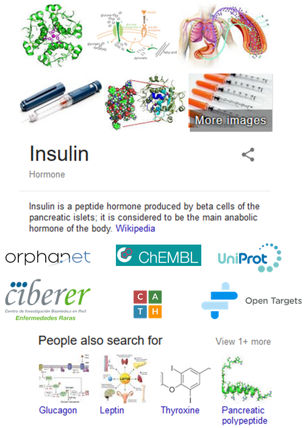
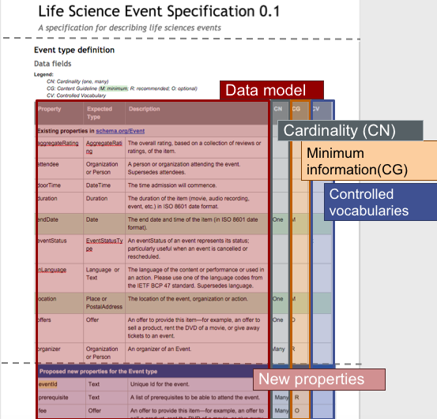

# Bioschemas, what and why?

>_In this tutorial you will learn what Bioschemas is, what the added value to schema.org.is and what the main elements in Bioschemas are._ 

## What is Bioschemas?

Bioschemas is a community project built on top of schema.org, aiming to improve interoperability in Life Sciences so resources can better communicate and work together by using a common markup on their websites.

While on schema.org you can get those nice summaries, Bioschemas aims to make it possible to get similar summaries but focused on Life Science resources as Proteins, Samples, Beacons, Tools, Training, Life science events and so on.

Imagine an insulin summary but rather than pointing to Wikipedia, including specialized resources such as Orphanet or CATH as seen on Figure 1. In this way you would get a quick overview while also links to relevant resources all in one search.

|  |
| __Figure 1. Insulin summary on a search engine__ |

## What are the benefits of Bioschemas?

Bioschemas inherits the benefits from schema.org, i.e., enabling machines to understand what your metadata is in advance, making it easier to find, integrate, and re-use your data. It also brings some benefits tailored to the Life Sciences community. In Figure 2, you can find a graphical summary of such benefits, which are explained in more detailed on the paragraphs below.

|  |
| __Figure 2: Event profile provided by Bioschemas for the Event type in schema.org__ |

<table>
  <tbody>
    <tr>
      <td align="center">
        
      </td>
      <td>
        Schema.org provides types while Bioschemas provides types and profiles. A profile is a customisation of type including guidelines on how to use it whithin the Life Sciences scope.  Disclaimer: Bioschemas does provides three types (BioChemEntity, DataRecord and LabProtocol) however those will not remain in Bioschemas but will be proposed and eventually integrated into schema.org
      </td>
    </tr>
  </tbody>
</table>

* Bioschemas focuses on key properties prioritised as Minimum, Recommended and Optional  based on community agreements and common practices

<table>
  <tbody>
    <tr>
      <td align="center">
        
      </td>
      <td>
        <ul><li>Minimum properties should be provided</li><li>Recommended properties should be provided whenever possible and available</li><li>Optional properties could be omitted unless important or relevant for your resource</li></ul>
         
        e.g., For the Event case shown on Figure 2, endDate and location are minimum while organizer is recommended.
         
        Reminder: a property helps you describe your resource
      </td>
    </tr>
  </tbody>
</table>

* Bioschemas provides additional recommendations regarding properties cardinality

<table>
  <tbody>
    <tr>
      <td align="center">
        
      </td>
      <td>
        A property expects ONE or MANY elements
         
e.g., For the Event case, endDate should be ONE while organizer could be MANY
      </td>
    </tr>
  </tbody>
</table>

* Bioschemas customises schema.org types (see previous tutorial) to better supports needs on the life sciences community

<table>
  <tbody>
    <tr>
      <td align="center">
        
      </td>
      <td>
        Event already exists in schema.org. However, Bioschemas has added some new properties, for instance, "prerrequisite" is commonly used in Life Sciences to list a list of required skills and so to be able to attend the event.
      </td>
    </tr>
  </tbody>
</table>

* Bioschemas reuses terms from well-known ontologies thus avoiding reinventing the wheel

<table>
  <tbody>
    <tr>
      <td align="center">
        
      </td>
      <td>
        Tools, a SoftwareApplication profile, recommends using terms from the <a href="http://bioportal.bioontology.org/ontologies/EDAM">EDAM</a> ontology in order to specify, for instance, the input and output expected.
         
        Protein, a BioChemEntity profile, includes some properties that come from well-known ontologies. For instance associatedWith comes from from the <a href="https://www.ebi.ac.uk/ols/ontologies/so">Sequence Ontology</a>. By reusing terms, Bioschemas aims to avoid reinventing the wheel.
      </td>
    </tr>
  </tbody>
</table>